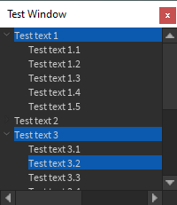
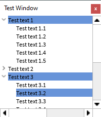
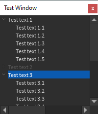
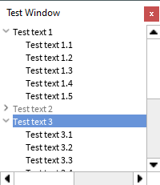

# Collapsable List
The main goal of Nexus Plugin Framework initially was
to simplify creating "collapsable lists" and plugin windows
while still acting similar to Roblox's `Instance.new(...)`
syntax. For the example below, a window is created with a
scrolling frame and collapsable frames are added.

```lua
--Load Nexus Plugin Framework as a ModuleScript contained in the script.
local NexusPluginFramework = require(script:WaitForChild("NexusPluginFramework"))

--The the window.
local WidgetInfo = DockWidgetPluginGuiInfo.new(
	Enum.InitialDockState.Float,
	true,
	false,
	200,
	200
)
local Window = NexusPluginFramework.new("PluginGui","Test Window",WidgetInfo)

--Create a scrolling frame.
local Background = NexusPluginFramework.new("ScrollingFrame","Qt5")
Background.Size = UDim2.new(1,0,1,0)
Background.CanvasSize = UDim2.new(2,0,2,0)
Background.Parent = Window

local ListLayout = NexusPluginFramework.new("UIListLayout")
ListLayout.Parent = Background

--Create the collapsable frames.
for i = 1,5 do
	--Create the list frame.
	local ListFrame = NexusPluginFramework.new("CollapsableListFrame")
	ListFrame.Parent = Background
	
	local TextLabel = NexusPluginFramework.new("TextLabel")
	TextLabel.Text = "Test text "..tostring(i)
	TextLabel.Size = UDim2.new(1,0,1,0)
	TextLabel.TextXAlignment = "Left"
	TextLabel.Parent = ListFrame:GetMainContainer()

	local ListLayout = NexusPluginFramework.new("UIListLayout")
	ListLayout.Parent = ListFrame:GetCollapsableContainer()
	
	--Create the sub frames.
	for j = 1,5 do
		local SubListFrame = NexusPluginFramework.new("CollapsableListFrame")
		SubListFrame.Parent = ListFrame:GetCollapsableContainer()
		
		local TextLabel = NexusPluginFramework.new("TextLabel")
		TextLabel.Text = "Test text "..tostring(i).."."..tostring(j)
		TextLabel.Size = UDim2.new(1,0,1,0)
		TextLabel.TextXAlignment = "Left"
		TextLabel.Parent = SubListFrame:GetMainContainer()
		
		--Select sub-frame 2 for list 3.
		if i == 3 and j == 2 then
			SubListFrame.Selected = true
		end
	end
	
	--Collapse and disable list frame 2.
	if i == 2 then
		ListFrame.Disabled = true
		ListFrame.Expanded = false
	end
	
	--Select frames 1 and 3.
	if i == 1 or i == 3 then
		ListFrame.Selected = true
	end
end
```

<br>


Note that above that elements aren't parented directly to the
list frames. This is because it is ambigous if it is intended
to be in the collapsable frame or the frame next to the arrow.
While the example above works, there may be some other features
that would be desirable to have, such as only having 1 item
being selected at a time or the list frame being disabled altering
the text of the list frame. This can be done with constraints applied
to the list frames.

```lua
--Load Nexus Plugin Framework as a ModuleScript contained in the script.
local NexusPluginFramework = require(script:WaitForChild("NexusPluginFramework"))

--The the window.
local WidgetInfo = DockWidgetPluginGuiInfo.new(
	Enum.InitialDockState.Float,
	true,
	false,
	200,
	200
)
local Window = NexusPluginFramework.new("PluginGui","Test Window",WidgetInfo)

--Create a scrolling frame.
local Background = NexusPluginFramework.new("ScrollingFrame","Qt5")
Background.Size = UDim2.new(1,0,1,0)
Background.CanvasSize = UDim2.new(2,0,2,0)
Background.Parent = Window

local ListLayout = NexusPluginFramework.new("UIListLayout")
ListLayout.Parent = Background

local SelectionConstraint = NexusPluginFramework.new("ListSelectionConstraint")
local ContentsPropertyConstraint = NexusPluginFramework.new("ListContentsPropertyConstraint")

--Create the collapsable frames.
for i = 1,5 do
	--Create the list frame.
	local ListFrame = NexusPluginFramework.new("CollapsableListFrame")
	ListFrame.Parent = Background
	SelectionConstraint:AddListFrame(ListFrame)
	ContentsPropertyConstraint:AddListFrame(ListFrame)
	
	local TextLabel = NexusPluginFramework.new("TextLabel")
	TextLabel.Text = "Test text "..tostring(i)
	TextLabel.Size = UDim2.new(1,0,1,0)
	TextLabel.TextXAlignment = "Left"
	TextLabel.Parent = ListFrame:GetMainContainer()

	local ListLayout = NexusPluginFramework.new("UIListLayout")
	ListLayout.Parent = ListFrame:GetCollapsableContainer()
	
	
	--Create the sub frames.
	for j = 1,5 do
		local SubListFrame = NexusPluginFramework.new("CollapsableListFrame")
		SubListFrame.Parent = ListFrame:GetCollapsableContainer()
		
		local TextLabel = NexusPluginFramework.new("TextLabel")
		TextLabel.Text = "Test text "..tostring(i).."."..tostring(j)
		TextLabel.Size = UDim2.new(1,0,1,0)
		TextLabel.TextXAlignment = "Left"
		TextLabel.Parent = SubListFrame:GetMainContainer()
		
		--Select sub-frame 2 for list 3.
		if i == 3 and j == 2 then
			SubListFrame.Selected = true
		end
	end
	
	--Collapse and disable list frame 2.
	if i == 2 then
		ListFrame.Disabled = true
		ListFrame.Expanded = false
	end
	
	--Select frames 1 and 3.
	if i == 1 or i == 3 then
		ListFrame.Selected = true
	end
end
```

<br>


When using multiple constraints, a multi-constraint can be
used instead to ensure that a list frame is added to all
constraints.
```lua
--Load Nexus Plugin Framework as a ModuleScript contained in the script.
local NexusPluginFramework = require(script:WaitForChild("NexusPluginFramework"))

--The the window.
local WidgetInfo = DockWidgetPluginGuiInfo.new(
	Enum.InitialDockState.Float,
	true,
	false,
	200,
	200
)
local Window = NexusPluginFramework.new("PluginGui","Test Window",WidgetInfo)

--Create a scrolling frame.
local Background = NexusPluginFramework.new("ScrollingFrame","Qt5")
Background.Size = UDim2.new(1,0,1,0)
Background.CanvasSize = UDim2.new(2,0,2,0)
Background.Parent = Window

local ListLayout = NexusPluginFramework.new("UIListLayout")
ListLayout.Parent = Background

local MultiConstraint = NexusPluginFramework.new("ListMultiConstraint")
local SelectionConstraint = NexusPluginFramework.new("ListSelectionConstraint")
local ContentsPropertyConstraint = NexusPluginFramework.new("ListContentsPropertyConstraint")
MultiConstraint:AddConstraint(SelectionConstraint)
MultiConstraint:AddConstraint(ContentsPropertyConstraint)

--Create the collapsable frames.
for i = 1,5 do
	--Create the list frame.
	local ListFrame = NexusPluginFramework.new("CollapsableListFrame")
	ListFrame.Parent = Background
	MultiConstraint:AddListFrame(ListFrame)
	
	local TextLabel = NexusPluginFramework.new("TextLabel")
	TextLabel.Text = "Test text "..tostring(i)
	TextLabel.Size = UDim2.new(1,0,1,0)
	TextLabel.TextXAlignment = "Left"
	TextLabel.Parent = ListFrame:GetMainContainer()

	local ListLayout = NexusPluginFramework.new("UIListLayout")
	ListLayout.Parent = ListFrame:GetCollapsableContainer()
	
	
	--Create the sub frames.
	for j = 1,5 do
		local SubListFrame = NexusPluginFramework.new("CollapsableListFrame")
		SubListFrame.Parent = ListFrame:GetCollapsableContainer()
		
		local TextLabel = NexusPluginFramework.new("TextLabel")
		TextLabel.Text = "Test text "..tostring(i).."."..tostring(j)
		TextLabel.Size = UDim2.new(1,0,1,0)
		TextLabel.TextXAlignment = "Left"
		TextLabel.Parent = SubListFrame:GetMainContainer()
		
		--Select sub-frame 2 for list 3.
		if i == 3 and j == 2 then
			SubListFrame.Selected = true
		end
	end
	
	--Collapse and disable list frame 2.
	if i == 2 then
		ListFrame.Disabled = true
		ListFrame.Expanded = false
	end
	
	--Select frames 1 and 3.
	if i == 1 or i == 3 then
		ListFrame.Selected = true
	end
end
```