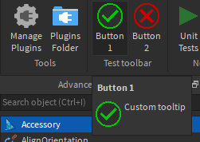

# Toolbar Example
Nexus Plugin Framework deviates a bit from
Roblox's native plugin system since objects
like the toolbar are created using `NexusPluginFramework.new(...)`
instead of a method in the `plugin` global.
As an example, the following script can
be used to create a toolbar with 2 buttons.

```lua
--Load Nexus Plugin Framework as a ModuleScript contained in the script.
local NexusPluginFramework = require(script:WaitForChild("NexusPluginFramework"))

--Create a toolbar and 2 buttons.
local Toolbar = NexusPluginFramework.new("PluginToolbar","Test toolbar")
local Button1 = Toolbar:CreateButton("Button 1","Custom tooltip","http://www.roblox.com/asset/?id=2702689330")
local Button2 = Toolbar:CreateButton("Button 2","Custom tooltip","http://www.roblox.com/asset/?id=2702690096")

--Connect the events.
Button1.Click:Connect(function()
	print("Button 1 clicked")
end)

Button2.Click:Connect(function()
	print("Button 2 clicked")
end)
```

